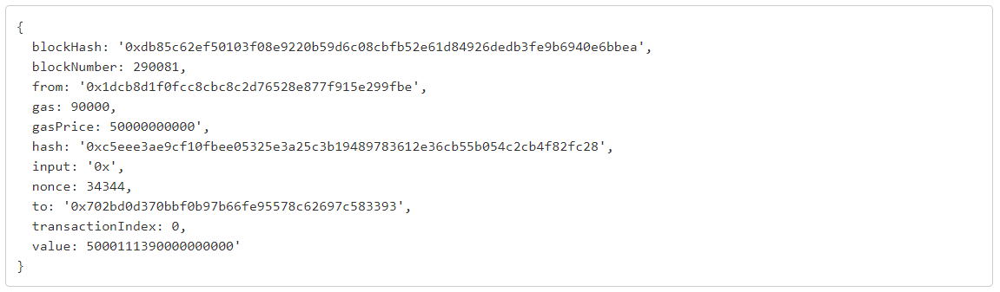

```{r setup, include=FALSE}
rm(list=ls())
knitr::opts_chunk$set(echo = TRUE, warning=FALSE, message=FALSE)

### To be removed at the end ###
EtherScanAPIToken <- "UJP16VCE9D29XFAA86RWADATJ5K4PBSYD9"
```


# Introduction

***What is the Blockchain:*** A blockchain is a growing list of records, called blocks, that are linked together using cryptography. It is used for recording transactions, tracking assets, and building trust between participating parties. Primarily known for Bitcoin and cryptocurrencies application, Blockchain is now used in almost all domains, including supply chain, healthcare, logistic, identity management... Hundreds of blockchains exist with their own specifications and applications: Bitcoin, Ethereum, Tezos...

***What are NFTs:*** Non-Fungible Tokens are used to represent ownership of unique items. They let us tokenize things like art, collectibles, even real estate. They can only have one official owner at a time and they're secured by the Blockchain, no one can modify the record of ownership or copy/paste a new NFT into existence. You've probably heard of the artist Beeple who sold one of his NFT art for \$69 million. 

***What is R:*** R language is widely used among statisticians and data miners for developing data analysis software. 

***Why doing data science on blockchain:*** As Blockchain technology is booming, there is a growing need in tools and people able to read, understand and summarize this type of information.

***What is an API:*** An API is a software intermediary that allows two applications to talk to each other. APIs are designed to help developers make requests to another software (i.e. downloading information) and getting results in predefined easy to read format, without having to understand how this software works.

There are already several articles dealing with blockchain data analysis in R, but most of them focus on price forecasting. Obtaining data on the cryptocurrencies price is quite straightforward, there are many databases available on internet. But how to actually read the blockchain? In this article, we will focus on reading blockchain transactions. Not all transactions but specifically, transactions related to NFTs. We will read the Ethereum blockchain, probably the top one used to trade NFTs. There exist several market places that that serve as trading platforms for  NFTs: OpenSea, Rarible… We will focus here on OpenSea, the largest NFT trading platform  at the moment.

Reading the raw blockchain is possible but it is hard. First of all, you have to setup a node and download the content of the blockchain (approximately 7TB at the time of writing). It may take a while to synchronize… Secondly, the data are stored sequentially which requires developing specific tools to follow a transaction. Third, the structure of the block is particularly difficult to read. As an example, a typical transaction on the Ethereum network is shown below. There are between 200 and 300 transactions per block and at the time of writing, we are at block 12586122.




Fortunately for us, there are APIs which facilitate our work.

```{r}
# First, let's load a few useful packages
library(tidyverse)
library(httr)
library(jsonlite)
library(scales)
library(waffle)
library(ggrepel)
```

# OpenSea API

OpenSea provides an API for fetching non-fungible ERC721 assets based on a set of query parameters. Let's have a look:

```{r}
# Retrieve sold NFTs 
resOpenSea <- GET("https://api.opensea.io/api/v1/events",
          query = list(limit=300, #number of events to retrieve
                       event_type="successful", #retrieve only the sales
                       only_opensea="true")) #retrieve only sales from the opensea website

# Convert the raw unicode (not human friendly) into JSON format 
# Don't forget the option flatten=TRUE, otherwise the objects will be a complex list of list of list, impossible to work with
dataOpenSea <- fromJSON(rawToChar(resOpenSea$content), flatten=TRUE)[[1]] 

# There are a lot of columns. We have to clean a bit.
# Let's start removing the one containing only NA values
dataOpenSea <- dataOpenSea %>% 
  select_if(~!all(is.na(.)))
```

There is not a lot of explanations on the content of this dataset on the OpenSea website. I thus selected a few columns which seemed to contain interesting information (at least the ones I could understand).

```{r}
# Let's select a few columns with interesting information
dataOpenSea <- dataOpenSea %>% select("collection_slug", 
                                      "contract_address", 
                                      "id", "quantity", 
                                      "payment_token.name", 
                                      "total_price", 
                                      "seller.address", 
                                      "transaction.timestamp", 
                                      "winner_account.address", 
                                      "payment_token.usd_price", 
                                      "payment_token.eth_price", 
                                      "asset.asset_contract.schema_name") 
#"asset.asset_contract.address", "asset.asset_contract.asset_contract_type", "asset.asset_contract.created_date", "asset.asset_contract.name"

# Get a glimpse of the data 
glimpse(dataOpenSea)
```

My guess is - here we have:

-   **collection_slug:** The collection to which the item belongs
-   **contract_address:** All the sales are managed by a contract (a piece of code / a software) which sends the NFT to the winner of the bid. This is the address of the OpenSea contract. We can see that there is only one address for all the sales, which means that all sales are managed by the same contract.
-   **id:** A unique identifier for each sale
-   **quantity:** The number of items sold per transaction (see fungible / semi fungible below). As in the supermarket, you can buy 1 apple or 20.
-   **payment_token.name:** The cryptocurrency used to buy the item.
-   **total_price:** The cost paid by the winner. For Ether, this is expressed in Wei, the smallest denomination of ether. 1 ether = 1,000,000,000,000,000,000 Wei (10\^18).
-   **seller.address:** The address of the seller
-   **transaction.timestamp:** Date of the transaction
-   **winner_account.address:** The address of the buyer
-   **payment_token.usd_price:** The price of one token used to make the transaction in USD

Let's have a look at the distribution of currencies:

```{r}
dataOpenSea %>% 
  group_by(payment_token.name) %>% 
  summarise(n=n())
```

We see that most sales are made in Ether (note that Wrapped Ether can be considered the same as Ether), let's focus on these Ether sales for the rest of the article.

```{r fig.cap=c("Histogram of the price per sale. Data from OpenSea API.", "Pie chart of the price per sale. Data from OpenSea API.", "Waffle chart of the price per sale. Data from OpenSea API.")}
# Change the format of some columns to something more adapted than character
dataOpenSea <- dataOpenSea %>% 
  mutate(quantity=as.numeric(quantity), 
         total_price=as.numeric(total_price), 
         transaction.timestamp=as.Date(transaction.timestamp), 
         payment_token.usd_price=as.numeric(payment_token.usd_price)) 

# filter on sales in ETH
dataOpenSea <- dataOpenSea %>% 
  filter(payment_token.name %in% c("Ether", "Wrapped Ether"))

# Convert the price in Ether and then USD. We divide by the quantity as one sale can contain multiple items and then divide by 10^18 to convert the price from Wei to ETH (see above).
dataOpenSea <- dataOpenSea %>% mutate(priceUSD = total_price / 10^18 * payment_token.usd_price / quantity)

# Let's visualize this
# Histogram of the price distribution (with a log scale as prices are quite spread)
pHistoOpenSea <- ggplot(dataOpenSea, aes(priceUSD)) + 
  geom_histogram() + 
  labs(x="Price (USD)") + 
  scale_x_log10(labels = comma)
ggsave("figures/histoOpenSea.png", pHistoOpenSea, height=7, width=7)
pHistoOpenSea

# Pie chart 
dataOpenSea$cut <- cut(dataOpenSea$priceUSD, breaks = c(0, 10, 100, 1000, 10000, 100000, 1000000),
                       labels = c("0-10USD", "10-100USD", "100-1000USD", "1000-10000USD", "10000-100000USD", "100000-1000000USD"), include.lowest = TRUE)

dataPieChartOpenSea <- dataOpenSea %>% 
  group_by(cut) %>% 
  count() %>% 
  ungroup() %>% 
  mutate(percent=`n`/sum(`n`)) %>% 
  arrange(desc(cut)) %>%
  mutate(label=scales::percent(percent))

pPieChartOpenSea <- ggplot(dataPieChartOpenSea, aes(x="", y=percent, fill=cut))+
geom_bar(width = 1, stat = "identity") +
  coord_polar("y", start=0) +
  geom_text_repel(aes(y = cumsum(percent) - percent/2, label=label)) +
  theme_void()
ggsave("figures/pieChartOpenSea.png", pPieChartOpenSea, height=7, width=7)
pPieChartOpenSea

# Waffle chart
pWaffleOpenSea <- waffle(dataPieChartOpenSea, rows = 8, reverse=TRUE)
ggsave("figures/waffleChartOpenSea.png", pWaffleOpenSea, height=5, width=7)
pWaffleOpenSea
```

This looks pretty nice but there is a big drawback… OpenSea API limits the number of events to the last 300 transactions. There is not that much we can do about it if we use their API. Also, the downloaded transactions are data pre-processed by OpenSea and not the blockchain itself. This is already a good start to have the information about transactions, but what if we wanted to read the the blocks? We have previously seen that retrieving data directly from the blockchain can be quite complex. Hopefully, there are services like Etherscan that allow you to explore Ethereum Blocks in an easy way. And guess what? They also developed an API!

# EtherScan API

EtherScan is a block explorer, which allows users to view information about transactions that have been submitted to the Ethereum blockchain, verify contract code, visualize network data... We can therefore use it to read any transaction involving NFTs! EtherScan limits the number of transactions to 10000 in its free version, which is much better than with the OpenSea API and you can still subscribe if you need more. 

Where do we start? Let's focus again on OpenSea: from the data we extracted above, we saw that the address of their contract is "0x7be8076f4ea4a4ad08075c2508e481d6c946d12b". If we enter this address in EtherScan and filter on the completed transaction (i.e. the transactions validated by the network, not the one waiting to be approved), <https://etherscan.io/txs?a=0x7be8076f4ea4a4ad08075c2508e481d6c946d12b>, we see an incredible amount of them (848,965 at the time of writing.) Of course, not all of them are related to sales.

Let’s see what we can do with these data.

```{r fig.cap=c("Histogram of the price per sale. Data from EtherScan API.", "Pie chart of the price per sale. Data from EtherScan API.", "Waffle chart of the price per sale. Data from EtherScan API.")}
# Retrieve the last 10000 transactions (maximum allowed by Etherscan) from the OpenSea contract
resEtherScan <- GET("https://api.etherscan.io/api",
          query = list(module="account", 
                       action="txlist", 
                       address="0x7Be8076f4EA4A4AD08075C2508e481d6C946D12b",
                       sort="desc",
                       apikey=EtherScanAPIToken))

# Convert the raw unicode (not human friendly) into JSON format 
# Don't forget the option flatten=TRUE, otherwise the objects will be a complex list of list of list, impossible to work with
dataEtherScan <- fromJSON(rawToChar(resEtherScan$content), flatten=TRUE)$result

dataEtherScan <- dataEtherScan %>% 
  mutate(value=as.numeric(value), # Convert price in numeric
         timeStamp=as.POSIXct(as.numeric(timeStamp), origin="1970-01-01")) # Convert the timestamp to a date

# There are many transactions with a value of 0 ether. Among them, not all are directly linked to sales. We won't go into details here, but there are many other types of actions that can be recorded as transactions (publishing a sale, maintenance of the contract...). Among those that are linked to sales, some involve a token transfer (wrapped ETH for instance) instead of ether directly. To keep things simple, let's keep only transactions involving transfer of some ether.
dataEtherScan <- dataEtherScan %>% 
  filter(value>0) 

# Convert ETH price in USD
# For this, we first need to obtain the last USD price
resEtherScanPrice <- GET("https://api.etherscan.io/api",
          query = list(module="stats", 
                       action="ethprice", 
                       apikey=EtherScanAPIToken))
dataEtherScanPrice <- fromJSON(rawToChar(resEtherScanPrice$content), flatten=TRUE)$result$ethusd %>% as.numeric()
 
dataEtherScan <- dataEtherScan %>%
  mutate(value=value/10^18) %>% #We divide by 10^18 to convert the price from Wei to ETH (see above). 
  mutate(priceUSD=value*dataEtherScanPrice) # convert in USD 

# Let's visualize this
# Histogram of the price distribution (with a log scale as prices are quite spread)
pHistoEtherScan <- ggplot(dataEtherScan, aes(priceUSD)) + 
  geom_histogram() + 
  labs(x="Price (USD)") + 
  scale_x_log10(labels = comma)
ggsave("figures/histoEtherScan.png", pHistoEtherScan, height=7, width=7)
pHistoEtherScan

# Pie chart
dataEtherScan$cut <- cut(dataEtherScan$priceUSD, breaks = c(0, 10, 100, 1000, 10000, 100000, 1000000),
                       labels = c("0-10USD", "10-100USD", "100-1000USD", "1000-10000USD", "10000-100000USD", "100000-1000000USD"), include.lowest = TRUE)

dataPieChartEtherScan <- dataEtherScan %>% 
  group_by(cut) %>% 
  count() %>% 
  ungroup() %>% 
  mutate(percent=`n`/sum(`n`)) %>% 
  arrange(desc(cut)) %>%
  mutate(label=scales::percent(percent))

pPieChartEtherScan <- ggplot(dataPieChartEtherScan, aes(x="", y=percent, fill=cut)) +
geom_bar(width = 1, stat = "identity") + 
  coord_polar("y", start=0) +
  geom_text_repel(aes(y = cumsum(percent) - percent/2, label=label)) +
  theme_void()
ggsave("figures/pieChartEtherScan.png", pPieChartEtherScan, height=7, width=7)
pPieChartEtherScan

# Waffle chart
dataPieChartEtherScan <- dataPieChartEtherScan %>%
  mutate(n=n/20)
pWaffleEtherScan <- waffle(dataPieChartEtherScan, 
                  rows = 10, 
                  reverse=TRUE,
                  xlab = "1 square = 20 sales") 
ggsave("figures/waffleChartEtherScan.png", pWaffleEtherScan, height=5, width=7)
pWaffleEtherScan
```

Note that the price conversion from ETH to USD is not entirely correct. We use current ETH/USD price while some transactions were done some time ago. Even within a single day, there can be substantial price variation! This can be easily solved by retrieving historical ETH/USD price, but this requires an EtherScan Pro account.

# Conclusion

This article is an introduction into how to read the blockchain and obtain transactions data that can be analyzed and visualized.  Here, we have shown an example of a simple analysis of blockchain transactions – distribution charts of NFT sales prices. This is a good start but there a lot more we could do! In Part II, we will investigate how to go further. We can, for example, follow specific NFTs and explore the duration of them being in possession after release and the rate of their subsequent reacquisition.  Please let me know which attributes you may find interesting. 

**Note that the code used to generate this article is available on my Github: https://github.com/tdemarchin/DataScienceOnBlockchainWithR-PartI**

**If you want to help me to subscribe to an EtherScan Pro account and be able to retrieve more transactions, don't hesitate to donate to my ETH address: 0xf5fC137E7428519969a52c710d64406038319169** 

# References

<https://docs.opensea.io/reference>
<https://www.dataquest.io/blog/r-api-tutorial/>
<https://ethereum.org/en/nft>
<https://influencermarketinghub.com/nft-marketplaces>
<https://www.r-bloggers.com/>
<https://etherscan.io/>
<https://en.wikipedia.org/wiki/Blockchain>
